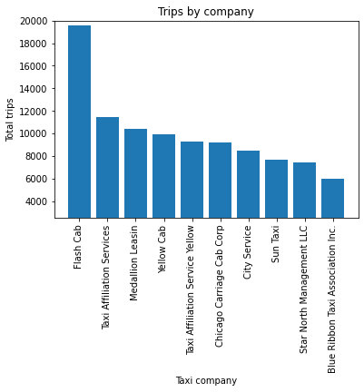
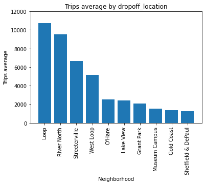

# Conclusiones

## Los clientes prefieren viajar en empresas como Flashcab,
- Se recomienda investigar sobre su oferta al cliente y evaluar si Zuber sería competetitiva
- La empresa FlashCab tiene amplia presencia en la ciudad, que su numero de viajes resulta atipico comparado a las otras que se mantienen en valores cercanos (al menos del top 10)

## También prefieren vaiajar a los barrios de Loop, Rivernorth y Streeteville
- Los barrios de Loop, Rivernorth y Streeteville son los destinos mas populares en los viajes realizados por las compañias

## Factores externos como el clima sí afecta la duración de los viajes
- De acuerdo con pruebas realizadas en la duración promedio de los viajes desde el Loop hasta el Aeropuerto Internacional O'Hare, este sí cambia los sabados lluviosos

El poder recuperar datos de distintas fuentes compatibles es una gran herramienta que nos permite tener mas información con la cual trabajar y relacionar a otro conjunto de datos que tengamos y complementar nuestro análisis

El uso de SQL es algo fundamental hoy dia en las industrias, la habilidad de comunicarse con bases de datos relacionales y obtener la información precisa que se requiera para algun análisis concreto
